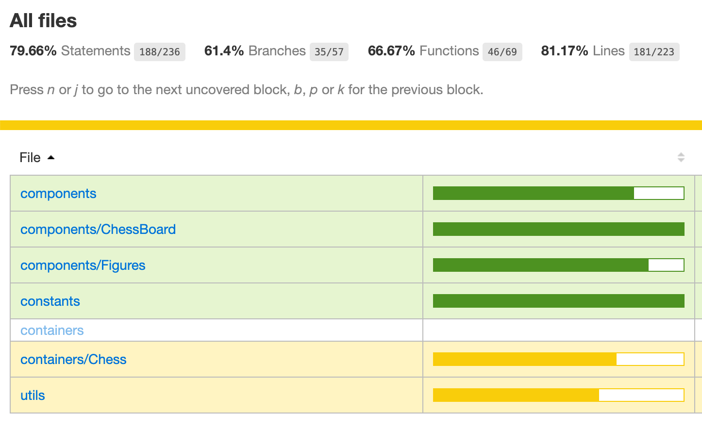

# This is a decision of the technical task

## Using React:
1. Display a chessboard with a default FEN of: 8/2p5/8/8/8/8/8/8 w KQkq - 0 1 (just one black pawn on «C7»)
2. Include a button that adds a white pawn to a random legal position on the board.
3. Allow that pawn to make legal moves across the board.
4. Ideally pawns should not appear on the first row (or the last one)
5. There is no need to handle pawn promotion, although that would be bonus points if you do.
6. Do not use any 3rd-party chess libraries.
7. Return your code in an online executable sandbox, such as https://codesandbox.io/

→→→→→→→→→→ 🔥 **<a href="https://chess-six.vercel.app/" target="_blank">Demo</a>** 🔥 ←←←←←←←←←←

## Overhead engineering:
1. Promotion for white pawn to become queen
2. Black pawn can moves and eats
3. Promotion for black pawn to become queen
4. Black and white queen can move and eat
